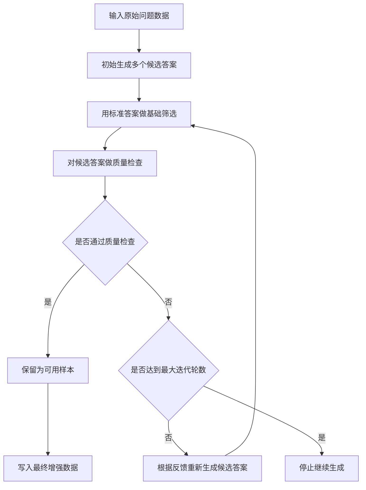

# Data Source Iteration Statistics

Run directory: `outputs/20260511_095408`

Total samples: `4391`

## 当前超参数设置

| 参数 | 当前值 |
|---|---:|
| 最大迭代轮数 | 8 |
| 每轮候选答案数 | 6 |
| verifier 判断次数 | 8 |
| verifier 接受阈值 | 0.5 |
| 生成温度 | 0.7 |
| top_p | 0.8 |
| top_k | 20 |

## 当前方法



流程示意图为/home/xry/paper/20260505/hithesis-3.1e/examples/hitbook/chinese/相关材料/multimodel/image.png


### compute_score_em=1

`compute_score_em=1` 表示模型生成的答案中，至少有一个候选答案和标准答案完全匹配。它反映的是“模型是否生成过可直接命中标准答案的结果”。

统计时只看候选答案本身是否命中标准答案，不把 verifier 的判断混入这个指标。

### verifier 通过

`verifier 通过` 表示模型生成的候选答案经过额外质量检查后被接受。它反映的是“答案不仅命中或接近标准答案，而且整体推理、检索和最终回答质量也被认为可用”。


我进行ssrl强化学习，收集自检索 self search rl（SSRL）中rollout数据，使用deepseek v4 flash进行标注是否错误，进行分析，验证三部分。标注10k数据，8/2分为训练/测试集。生成反思验证数据集
```
VERIFIER_PROMPT_TEMPLATE = """You are a professional quality evaluator for a Q&A system. Your task is to analyze an AI model's "think-retrieve-answer" process, determine if any errors exist in any part of the process, and analyse ALL errors throughout the entire process. If the model thinks it lacks knowledge, it will search using <search>query</search> and then produce its own generated information <information>information</information>, and use information above to answer, which means it does not retrieve from any external data source but answers by itself.

Input Format
You will receive the following information:

Question: The user's original question
Model Output: The model's complete think-retrieve-answer process
Ground Truth: The correct answer

Your Task
Please analyze according to the following steps:

Step 1: Review
Review model's "think-retrieve-answer" process, judging whether process is correct.

Step 2: Error Explanation
For each error, briefly explain why the specific step is wrong and what the correct approach/information should be. Since the model does not retrieve from any external data source but answers by itself, you should not mention using other source information in the feedback, but instead guide it to generate the correct reasoning, query, and corresponding correct information.

Output Format (Strict JSON)
For error samples, output:

{{
  "step_by_step_analysis": "review the 'think-retrieve-answer' process and explain your reasoning",
  "has_error": true,
  "error_description": "describe each error content in detail.",
  "reflection_feedback": "guide how to fix errors above"
}}

For correct samples, output:

{{
  "step_by_step_analysis": "review the 'think-retrieve-answer' process and explain your reasoning",
  "has_error": false,
  "verification": "Briefly explain why each step is correct"
}}

Now please analyze the following sample:

Question: {question}

Model Output: {model_output}

Ground Truth: {ground_truth}

Please output your final analysis result strictly in the JSON format specified above.
"""
```

使用反思验证数据集对qwen2.5 3b instruct 进行sft，即为上述verifier
使用generator指的是进行了ssrl训练的qwen2.5 3b instruct

### 当前与累计

- `current`：当前这一轮满足条件的样本数。
- `cumulative`：从第 0 轮到当前轮，曾经满足过条件的样本数。
- `new`：当前这一轮首次满足条件的样本数。

## 迭代生成流程

1. `answer_rollout.jsonl`

   第 0 轮初始生成。模型先为每个问题生成多个候选答案，然后用标准答案做一次基础筛选，找出已经直接答对的样本。

2. `verify_iter_N.jsonl`

   对当前候选答案做更严格的质量检查。通过这一轮检查的样本会被视为可用样本。

3. `regenerate_iter_{N+1}.jsonl`

   对未通过质量检查的样本，模型会参考上一轮反馈重新生成答案。已经通过的样本不需要重新生成。

4. 循环停止

   生成、检查、再生成会循环多轮。本次运行最多进行 8 轮，最终增强集来自最后一轮中通过质量检查的样本。

## Data Source 总量

| data_source | total |
|---|---:|
| bamboogle | 125 |
| hotpotqa | 500 |
| musique | 500 |
| nq | 500 |
| popqa | 500 |

## 最终累计结果

| data_source | total | cumulative EM=1 | EM=1 rate | cumulative verifier pass | verifier pass rate | verifier / EM=1 |
|---|---:|---:|---:|---:|---:|---:|
| bamboogle | 125 | 121 | 96.80% | 101 | 80.80% | 83.47% |
| hotpotqa | 500 | 447 | 89.40% | 378 | 75.60% | 84.56% |
| musique | 500 | 462 | 92.40% | 348 | 69.60% | 75.32% |
| nq | 500 | 455 | 91.00% | 337 | 67.40% | 74.07% |
| popqa | 500 | 493 | 98.60% | 334 | 66.80% | 67.75% |

## 每轮按 Data Source 统计

| iter | data_source | total | EM=1 current | EM=1 cumulative | EM=1 new | verifier current | verifier cumulative | verifier new |
|---:|---|---:|---:|---:|---:|---:|---:|---:|
| 0 | bamboogle | 125 | 42 | 42 | 42 | 18 | 18 | 18 |
| 0 | hotpotqa | 500 | 136 | 136 | 136 | 55 | 55 | 55 |
| 0 | musique | 500 | 50 | 50 | 50 | 10 | 10 | 10 |
| 0 | nq | 500 | 147 | 147 | 147 | 61 | 61 | 61 |
| 0 | popqa | 500 | 171 | 171 | 171 | 10 | 10 | 10 |
| 1 | bamboogle | 125 | 97 | 101 | 59 | 58 | 59 | 41 |
| 1 | hotpotqa | 500 | 354 | 364 | 228 | 206 | 222 | 167 |
| 1 | musique | 500 | 353 | 359 | 309 | 150 | 155 | 145 |
| 1 | nq | 500 | 377 | 392 | 245 | 213 | 224 | 163 |
| 1 | popqa | 500 | 432 | 447 | 276 | 152 | 156 | 146 |
| 2 | bamboogle | 125 | 87 | 107 | 6 | 62 | 73 | 14 |
| 2 | hotpotqa | 500 | 364 | 405 | 41 | 229 | 282 | 60 |
| 2 | musique | 500 | 349 | 412 | 53 | 175 | 210 | 55 |
| 2 | nq | 500 | 386 | 428 | 36 | 235 | 265 | 41 |
| 2 | popqa | 500 | 410 | 477 | 30 | 171 | 207 | 51 |
| 3 | bamboogle | 125 | 97 | 116 | 9 | 68 | 83 | 10 |
| 3 | hotpotqa | 500 | 376 | 424 | 19 | 250 | 316 | 34 |
| 3 | musique | 500 | 344 | 430 | 18 | 201 | 263 | 53 |
| 3 | nq | 500 | 390 | 440 | 12 | 236 | 285 | 20 |
| 3 | popqa | 500 | 430 | 487 | 10 | 173 | 246 | 39 |
| 4 | bamboogle | 125 | 96 | 118 | 2 | 70 | 89 | 6 |
| 4 | hotpotqa | 500 | 380 | 432 | 8 | 274 | 336 | 20 |
| 4 | musique | 500 | 369 | 447 | 17 | 209 | 285 | 22 |
| 4 | nq | 500 | 389 | 446 | 6 | 254 | 302 | 17 |
| 4 | popqa | 500 | 429 | 489 | 2 | 185 | 277 | 31 |
| 5 | bamboogle | 125 | 99 | 120 | 2 | 72 | 92 | 3 |
| 5 | hotpotqa | 500 | 387 | 441 | 9 | 285 | 356 | 20 |
| 5 | musique | 500 | 348 | 452 | 5 | 217 | 308 | 23 |
| 5 | nq | 500 | 384 | 450 | 4 | 263 | 317 | 15 |
| 5 | popqa | 500 | 434 | 491 | 2 | 198 | 299 | 22 |
| 6 | bamboogle | 125 | 104 | 121 | 1 | 81 | 100 | 8 |
| 6 | hotpotqa | 500 | 378 | 443 | 2 | 286 | 368 | 12 |
| 6 | musique | 500 | 351 | 456 | 4 | 241 | 330 | 22 |
| 6 | nq | 500 | 386 | 450 | 0 | 264 | 326 | 9 |
| 6 | popqa | 500 | 432 | 493 | 2 | 216 | 320 | 21 |
| 7 | bamboogle | 125 | 107 | 121 | 0 | 73 | 101 | 1 |
| 7 | hotpotqa | 500 | 381 | 447 | 4 | 284 | 378 | 10 |
| 7 | musique | 500 | 358 | 462 | 6 | 249 | 348 | 18 |
| 7 | nq | 500 | 392 | 455 | 5 | 269 | 337 | 11 |
| 7 | popqa | 500 | 424 | 493 | 0 | 221 | 334 | 14 |


